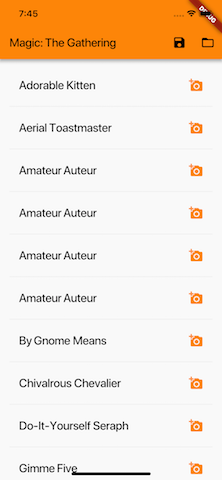
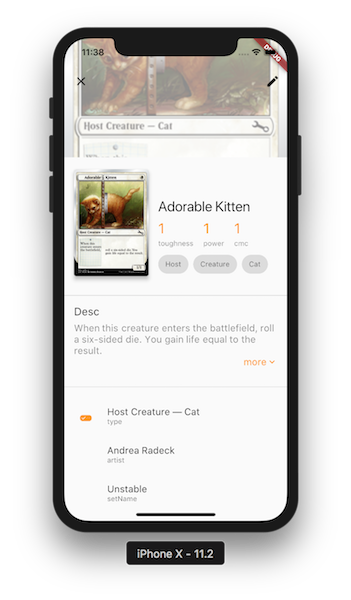

# Magic API &amp; Flutter

* data is fetched from [Magic API](https://docs.magicthegathering.io/) at startup
* details page is composed of 4-5 configurable blocks (you may choose the attributes to render in each block)

# Next steps
* config window
	* add more (bundled) API endpoints
	* "change endpoint" to choose from a list of bundled & user API endpoints
	* "add new endpoint" logic & form
* add more widgets to details view:
  	* chips
  	* stats (similar to twitter stats)
4ac7d7e147f5505b66e74ce6698193a58f796776/67682/images/from-wireframes-to-flutter-movie-details-page/movie_details_ui_result.png)

# Recently added
* toggle view list/grid
* config screen
* rebuild details page closer to [this](https://d33wubrfki0l68.cloudfront.net/
