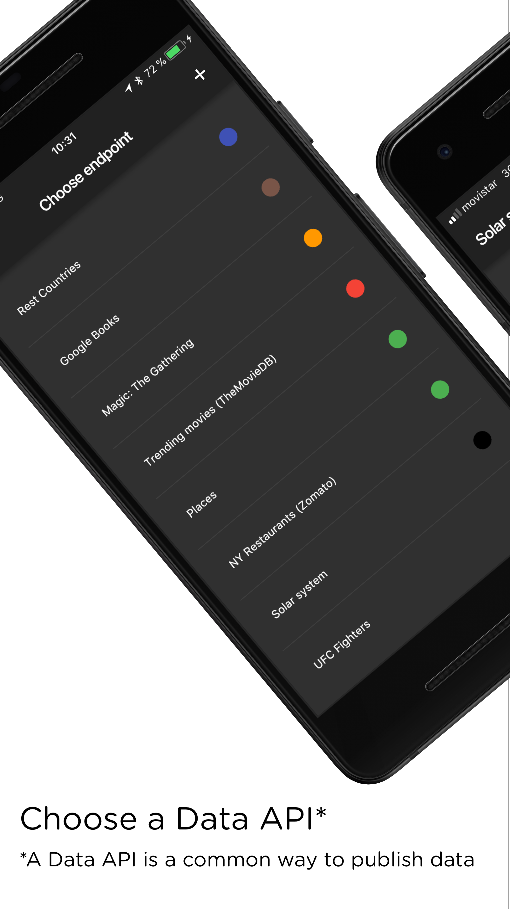
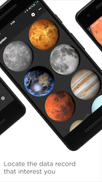
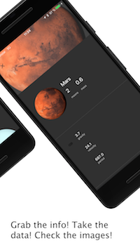
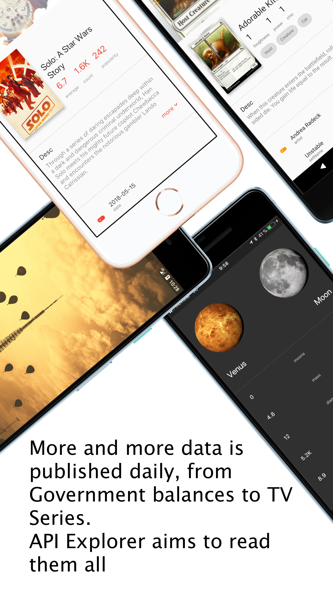
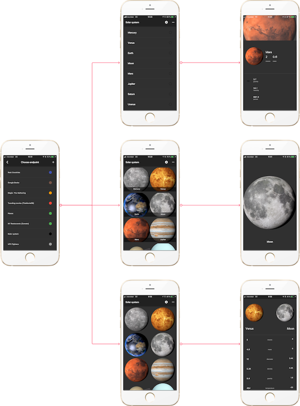

# Now in beta@Google Play 

 https://play.google.com/store/apps/details?id=apiexplorer.com.app

# Magic API &amp; Flutter

* data is fetched from an API endpoint
* data is shown in listing+detail
* 3 flavours for listing (list, gridWithName, gridWithoutName)
* 3 flavours for detail (hero, data, compare)

# Next steps
* list page
	* search (in results) & set query parameter
* welcome screen
* cupertino style?
* detail window
	* related items widget
* change API endpoint window
	* "add new endpoint" logic & form
* detailconfig window
	* new chips, stats widgets, new fields are still not configurable

# Recently added
* analytics
	* basic scaffolding
	* add more and more
* startup
	* choose last used EndPoint
* "about this API" dialog
* icon, splash
* list page
	* toggle view list/grid
	* more styles: gridWithText, gridWithoutText
* config/change API screen
	* sorted by endpoint (so that same-domain endpoints are grouped together)
	* "change endpoint" to choose from a list of bundled & user API endpoints (recently used first)
	* show color
	* added google books API
	* added (static) Planets API in 3 flavours
	* added (static) Places API
* detail window
	* more styles: heroStyle + compareStyle
	* poster photos are wiser now, if the image is a png it doesn't show a border
	* open main image
	* images widget
	* rebuild to be closer to [this](https://d33wubrfki0l68.cloudfront.net/4ac7d7e147f5505b66e74ce6698193a58f796776/67682/images/from-wireframes-to-flutter-movie-details-page/movie_details_ui_result.png)

